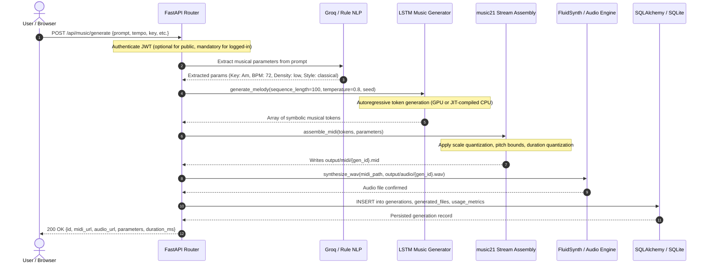
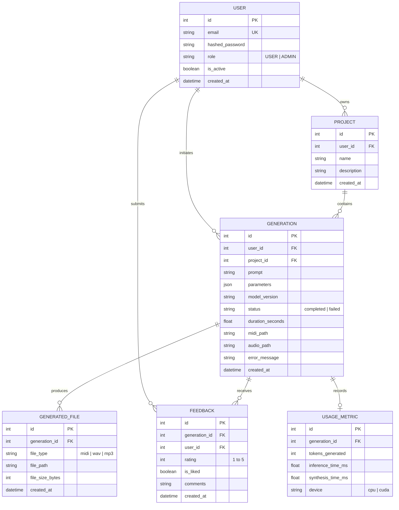

# AI Music Studio — System Architecture Specification

## 1. Executive Summary

**AI Music Studio** is an end-to-end, enterprise-ready generative music workstation that bridges natural language creative intent with deep learning symbolic composition and high-fidelity audio synthesis. Rather than treating music generation as an unconstrained black box, the platform utilizes a decoupled, multi-tier pipeline:

1. **Natural Language Understanding (NLU)**: Translates user prompts into formal music theory parameters via Groq's high-speed inference engine (Llama-3/Mixtral), with automatic fallback to a deterministic rule-based NLP extractor.
2. **Deep Symbolic Generation**: Employs an autoregressive Long Short-Term Memory (LSTM) recurrent neural network trained on the Google Magenta MAESTRO v3.0.0 classical repertoire to produce musically coherent note and chord sequences.
3. **Music Theory & Quantization Engine**: Leverages `music21` to enforce harmonic consistency, scale constraints, voice leading, and rhythmic quantization before assembling Standard MIDI File (SMF Type 1) streams.
4. **WAV Audio Synthesis**: Synthesizes studio-grade audio via FluidSynth and SoundFont sound banks, with an embedded pure-Python sine wave synthesizer fallback.
5. **Full-Stack Application & Security**: A modern React 18 + Vite frontend interfacing with a hardened FastAPI backend, protected by JWT authentication, role-based access control (RBAC), rate limiting, and an SQLAlchemy ORM persistence layer.

---

## 2. High-Level System Architecture

```
                                  [ USER / CLIENT ]
                                          │
                                          │ HTTPS / REST
                                          ▼
                               ┌─────────────────────┐
                               │  Vite + React UI    │
                               │  (HTML5 Audio / Web)│
                               └──────────┬──────────┘
                                          │
                                          │ JSON / Bearer JWT
                                          ▼
┌─────────────────────────────────────────────────────────────────────────────┐
│                       FASTAPI BACKEND APPLICATION                           │
│                                                                             │
│  ┌──────────────────────┐  ┌───────────────────────┐  ┌──────────────────┐  │
│  │ Security & Auth      │  │ Rate Limiting         │  │ CORS & Headers   │  │
│  │ (JWT, Passlib, RBAC) │  │ (Slowapi In-Memory)   │  │ (HSTS, CSP, etc) │  │
│  └──────────┬───────────┘  └───────────┬───────────┘  └─────────┬────────┘  │
│             │                          │                        │           │
│  ┌──────────▼──────────────────────────▼────────────────────────▼────────┐  │
│  │                            API ROUTERS                                │  │
│  │  /api/auth/*   /api/music/*   /api/generations/*   /api/admin/*       │  │
│  └─────────────────────────────────────┬─────────────────────────────────┘  │
│                                        │                                    │
│  ┌─────────────────────────────────────▼─────────────────────────────────┐  │
│  │                     ORCHESTRATION SERVICES                            │  │
│  │                                                                       │  │
│  │  1. Prompt Parsing Service:                                           │  │
│  │     - Primary: Groq Cloud API (Llama-3-70b / Mixtral-8x7b)            │  │
│  │     - Fallback: Local Regex & Music Theory Parameter Matcher          │  │
│  │                                                                       │  │
│  │  2. Deep Learning Inference Service:                                  │  │
│  │     - Model Singleton Manager (TensorFlow/Keras 2-Layer LSTM)         │  │
│  │     - Top-k / Nucleus / Temperature Sampling                         │  │
│  │     - Seed Sequence Tokenizer & Embedding Pipeline                    │  │
│  │                                                                       │  │
│  │  3. Symbolic Music Assembly (music21):                                │  │
│  │     - Stream & Part Creation (Tempo, Key, TimeSig)                    │  │
│  │     - Quantization, Chord Construction, Velocity Scaling              │  │
│  │     - MIDI Writer (Type 1 SMF)                                        │  │
│  │                                                                       │  │
│  │  4. Audio Synthesis Service:                                          │  │
│  │     - Primary: FluidSynth CLI Wrapper + SoundFont (SF2)               │  │
│  │     - Fallback: Pure-Python Sine Wave Additive Synthesizer (WAV)       │  │
│  └──────────────────┬─────────────────────────────────┬──────────────────┘  │
│                     │                                 │                     │
└─────────────────────┼─────────────────────────────────┼─────────────────────┘
                      │                                 │
                      ▼                                 ▼
         ┌────────────────────────┐        ┌────────────────────────┐
         │     STORAGE LAYER      │        │     EXTERNAL APIS      │
         │                        │        │                        │
         │  SQLite (WAL Mode)     │        │  Groq Cloud API        │
         │  / PostgreSQL Ready    │        │  (llama3-70b-8192)     │
         │  SQLAlchemy 2.0 ORM    │        └────────────────────────┘
         │                        │
         │  Local File System:    │
         │  output/midi/*.mid     │
         │  output/audio/*.wav    │
         └────────────────────────┘
```

---

## 3. Data Flow & Generation Lifecycle

The generation lifecycle follows an explicit 8-stage sequence:



---

## 4. Component Deep Dive

### 4.1 Frontend Tier (`frontend/`)
- **Technology Stack**: React 18, Vite 5, Tailwind CSS, Lucide React, Axios.
- **Key Modules**:
  - `PromptStudio.jsx`: Interactive command center allowing freeform creative prompts, real-time audio playback, waveform visualizer, and parameter override drawers (BPM slider, scale picker, mood selectors).
  - `AdminDashboard.jsx`: Role-gated administration console reporting real-time database KPIs, system metrics, user generation history, and feedback charts.
  - `AuthContext.jsx`: Client-side JWT session lifecycle manager with automatic header injection and local storage synchronization.
  - `AudioPlayer.jsx`: HTML5 audio controller with loop control, scrubbing, volume ramping, and dual format downloads (`.mid` and `.wav`).

### 4.2 API & Routing Tier (`backend/app/api/`)
- **Technology Stack**: FastAPI 0.110+, Pydantic v2, Starlette.
- **Routing Endpoints**:
  - `/api/auth`: User registration, token acquisition (`POST /token`), logout, and profile queries (`GET /me`).
  - `/api/music`: Symbolic generation triggers (`POST /generate`), parameter extraction preview (`POST /parse-prompt`), and format conversions.
  - `/api/generations`: Paginated historical retrieval (`GET /`), item retrieval (`GET /{id}`), and download proxying with path-traversal validation.
  - `/api/feedback`: Generation quality feedback ingestion (rating 1–5, likes, dislikes, commentary).
  - `/api/admin`: Administrative metrics, dataset status inspection, error logging, and user registry audits.

### 4.3 Natural Language Understanding (`backend/app/services/groq_service.py`)
- **Primary Engine**: Groq Cloud API with ultra-low latency execution of `llama-3.3-70b-versatile` or `mixtral-8x7b-32768`.
- **System Prompt Design**: Strictly enforces RFC 8259 JSON compliance. Extracts:
  - `tempo` (integer, 40–240 BPM)
  - `key` (root pitch letter, e.g., "C", "F#")
  - `mode` ("major" or "minor")
  - `time_signature` ("4/4", "3/4", "6/8")
  - `note_density` ("low", "medium", "high")
  - `mood` ("happy", "melancholy", "dramatic", "ambient", etc.)
- **Resilience Strategy**: If the Groq API key is missing, network fails, or the response fails schema validation, the system gracefully falls back to a deterministic regular-expression keyword parser without interrupting the user experience.

### 4.4 Symbolic Generation Tier (`ml/music_generator.py`)
- **Architecture**: 2-layer Recurrent Neural Network with Long Short-Term Memory (LSTM) cells (512 units per layer) and 30% Dropout regularization.
- **Vocabulary**: 458 distinct symbolic tokens representing single pitches, polyphonic chord combinations, and rhythmic rests extracted from the MAESTRO dataset.
- **Singleton Caching**: The model is loaded once at application startup into an active memory singleton (`models/lstm_music_model.h5`), avoiding recurrent 2-second deserialization costs per API request.
- **Sampling Mechanics**: Softmax temperature scaling combined with top-k filtering prevents repetitive loops while maintaining musical coherence.

### 4.5 Music Theory & Stream Construction (`backend/app/services/music_theory.py`)
- **Engine**: `music21` library.
- **Harmonic Filtering**: Validates generated pitch tokens against the target scale (e.g., A natural minor) and resolves illegal chromatic notes to the nearest diatonic degree when requested.
- **Octave Guard**: Restricts pitches to playable acoustic piano registers (MIDI note 21 to 108).
- **Rhythmic Quantization**: Snaps arbitrary floating-point offsets to standard fractional musical durations (quarter, eighth, sixteenth notes).

### 4.6 Audio Synthesis Engine (`backend/app/services/audio_renderer.py`)
- **FluidSynth Engine**: Calls FluidSynth CLI to render General MIDI soundfont banks (`GeneralUser_GS.sf2`) into 44.1 kHz, 16-bit stereo PCM WAV files.
- **Python Native Synthesizer**: In headless containerized environments without FluidSynth installed, the engine invokes a built-in mathematical sine wave synthesizer generating polyphonic ADSR envelopes directly to `.wav`.

---

## 5. Persistence & Data Architecture



---

## 6. Security & Hardening Boundaries

| Security Domain | Implementation Standard | Architecture Enforcement |
| :--- | :--- | :--- |
| **Authentication** | OAuth2 Password Bearer + JWT (HMAC-SHA256) | Expiry tokens (default 60 mins), secret keys isolated to `.env`. |
| **Password Storage** | PBKDF2 with SHA-256 / bcrypt | Work factor of 100,000+ iterations; plaintext passwords never touch DB. |
| **Access Control (RBAC)** | Role claims in JWT payload | Strict FastAPI dependency injection (`require_admin`, `get_current_user`). |
| **Path Traversal Defense** | Canonical path resolution (`os.path.realpath`) | Output file downloads strictly confined to white-listed `output/` directory. |
| **Input Sanitization** | Pydantic v2 validation | String bounds, type checking, pitch and tempo clamping (40–240 BPM). |
| **Secret Protection** | Zero-trust logging | Secret maskers prevent API keys, hashes, and tokens from entering stdout or logs. |
| **Traffic Throttling** | Slowapi Rate Limiting | Protects expensive compute endpoints (`/generate`: 5 requests/min/IP). |

---

## 7. Fault Tolerance & Fallback Matrix

```
[User Generation Request]
        │
        ├─► [Groq API Available?]
        │         ├─► YES: Use LLM parameter extraction (Llama-3)
        │         └─► NO:  Seamlessly invoke local regex / rule-based extractor
        │
        ├─► [GPU Available?]
        │         ├─► YES: Execute TensorFlow LSTM on CUDA device
        │         └─► NO:  Execute JIT-compiled graph on multi-threaded CPU
        │
        ├─► [Trained Model Weights Found?]
        │         ├─► YES: Run inference on 'models/lstm_music_model.h5'
        │         └─► NO:  Employ harmonic procedural fallback stream
        │
        └─► [FluidSynth Installed?]
                  ├─► YES: Render stereo audio via SoundFont
                  └─► NO:  Synthesize PCM WAV via built-in pure Python synthesizer
```

This multi-level fallback architecture guarantees that **AI Music Studio never returns a fatal 500 error due to external service unavailability**.
